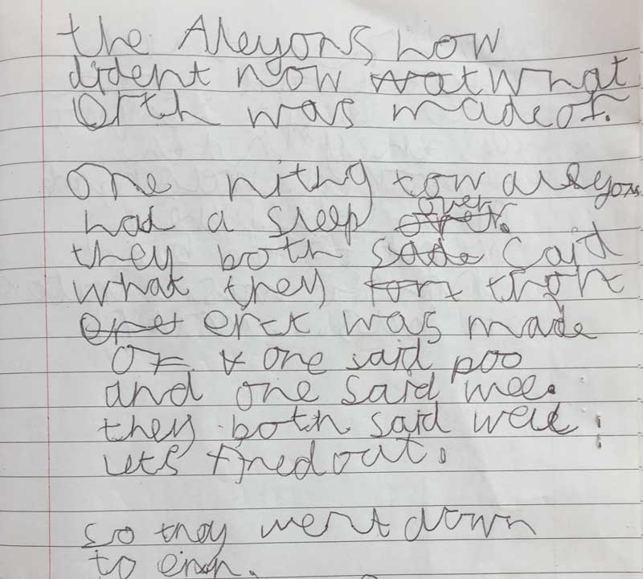
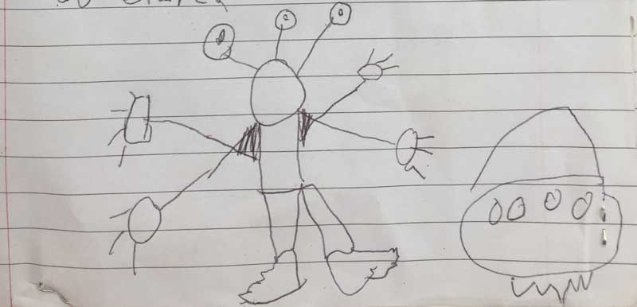
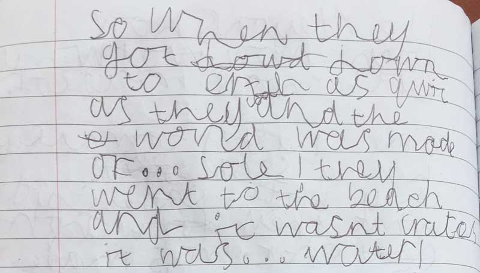
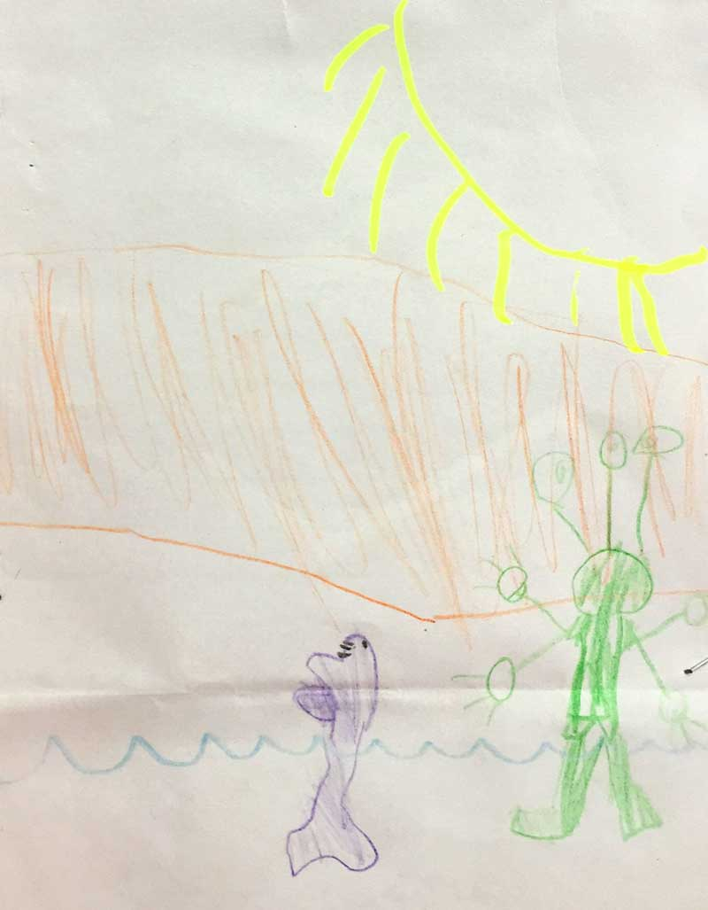
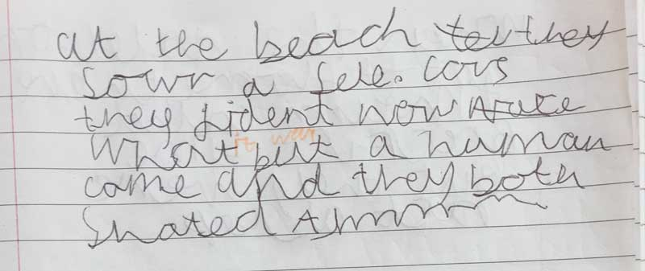
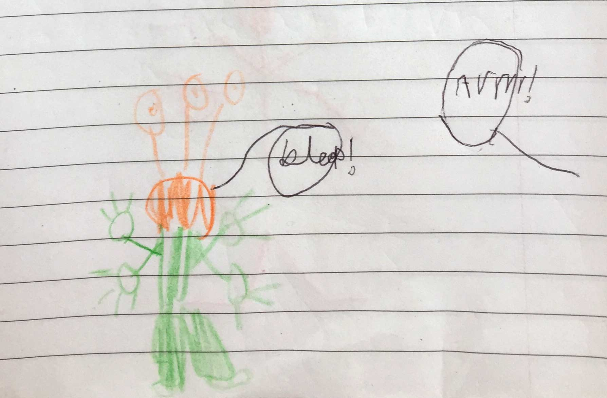
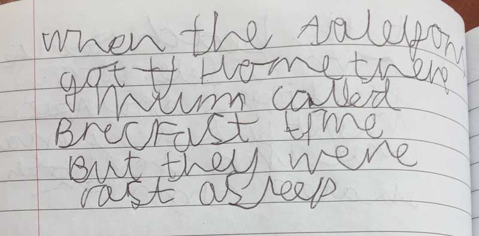
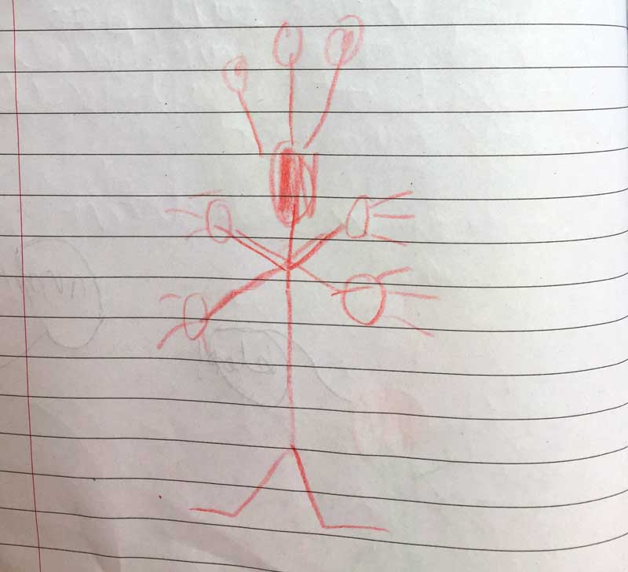

### The Aliens who didn't know what Earth was made of

One night, two aliens had a sleep over. They both said what they thought Earth was made of.

One said, "POO" and one said "WEE".

They both said, "Well, lets find out".

So they went down to Earth.

So when they got down to Earth as quick as they could, and the world was made of... SOIL!

They went to the beach and it wasn't craters, it was... WATER!

At the beach, they saw a seal. Of course they didn't know what it was but a human came and they both shouted, "Aahhhhh"!

When the aliens got home, their mum called, "Breakfast time", but they were fast asleep...

