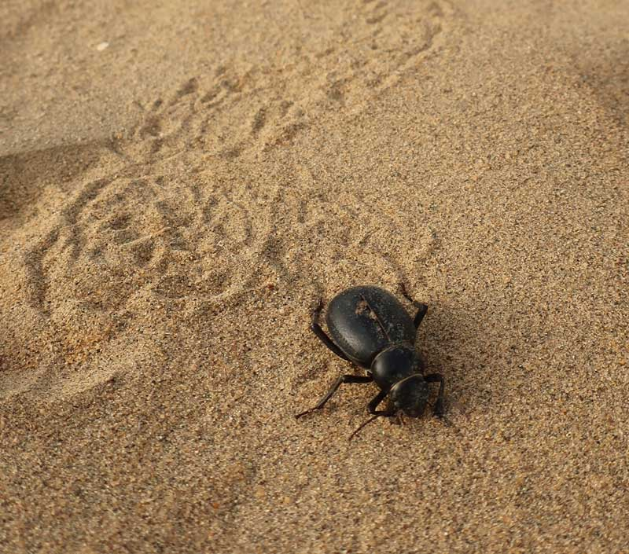
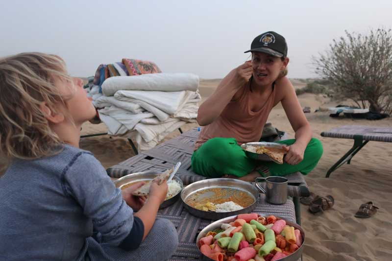

We got up early on the train. I drank Mummy's chai while she was asleep.

We got off the train and went in a jeep into the desert. It was colder than the city!

We saw tumble weed.

We got to go on a camel...

=YOUTUBESTART=WHG6-wjQ70A=YOUTUBEEND=

=YOUTUBESTART=NSzgVdgcitg=YOUTUBEEND=

...and when we got to camp, Elliot and me played in the sand dunes.

=YOUTUBESTART=eyEh8kVRByM=YOUTUBEEND=

=YOUTUBESTART=gBSeBdqCOsQ=YOUTUBEEND=

=YOUTUBESTART=gBSeBdqCOsQ=YOUTUBEEND=

We got no tent, instead we slept under the stars.

We saw loads of Dung beetles.

I saw loads of skeletons and bones. I found big horns - 2 of them.

The men sang Indian songs.

