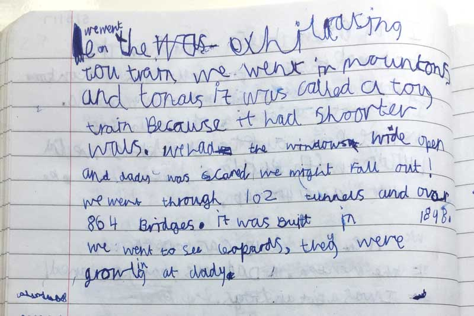

We went on the exhilarating toy train.
        
We went in mountains and tunnels.
        
It was called a toy train because it had shorter walls.
        
We had the windows wide open and Daddy was scared we might fall out!
        
We went through 102 tunnels and over 864 bridges. It was built in 1898.

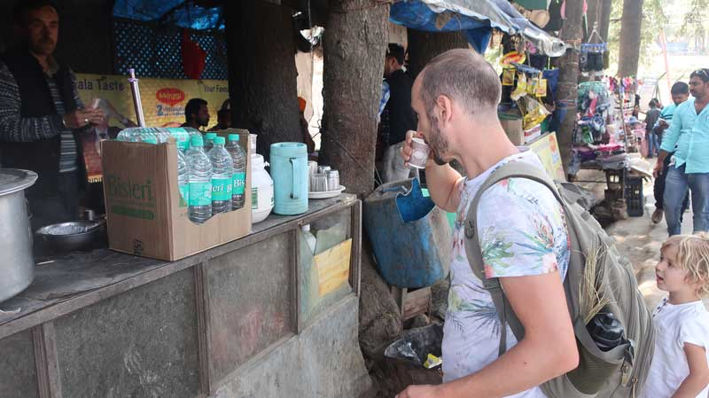
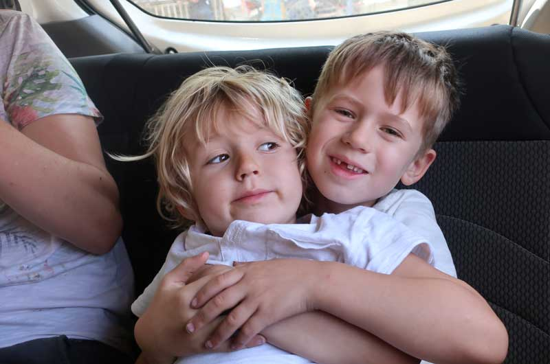
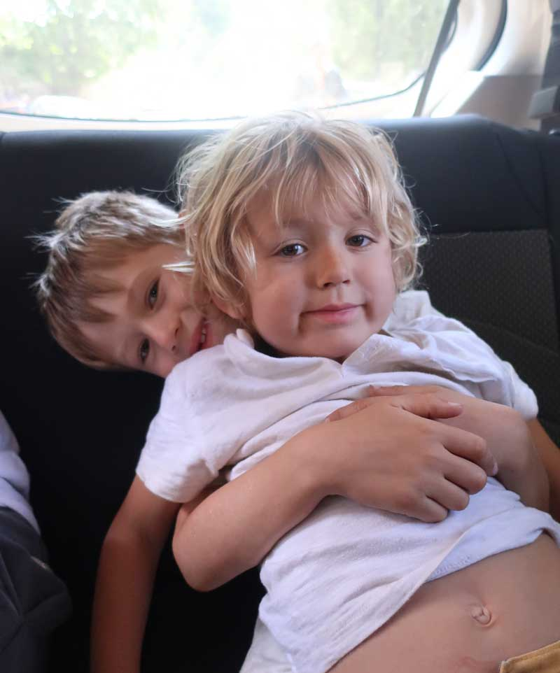
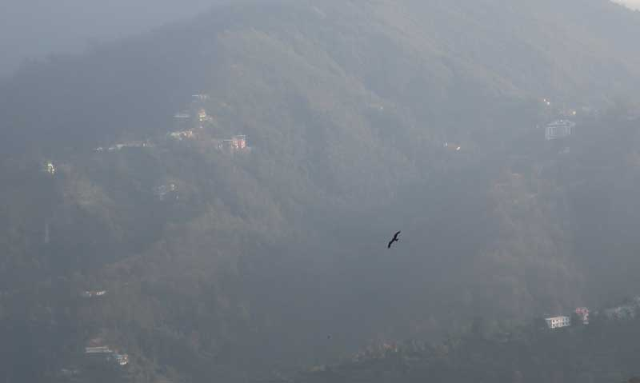

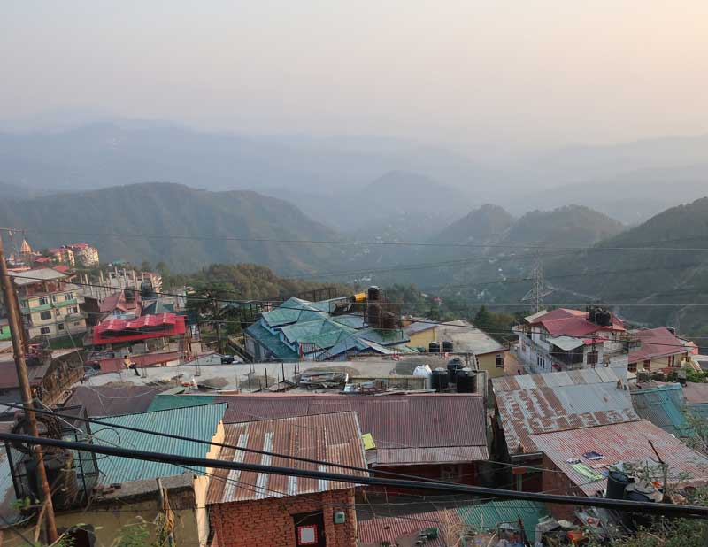
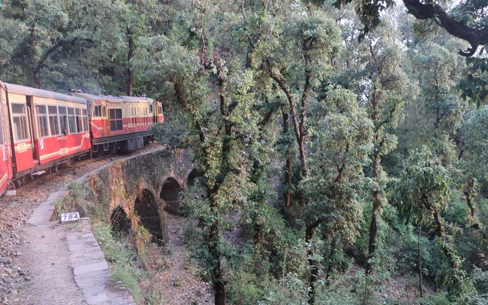
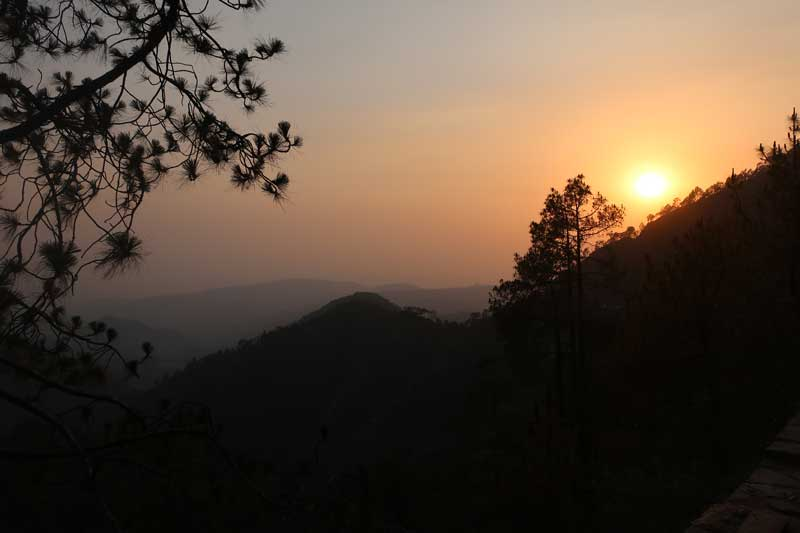
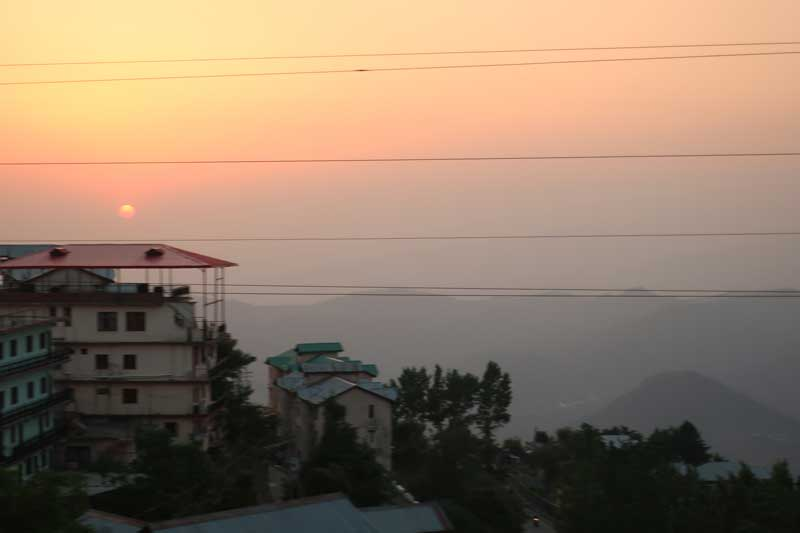
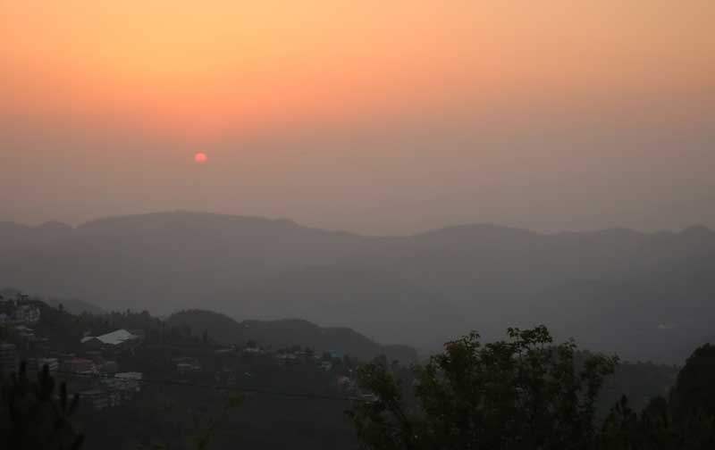
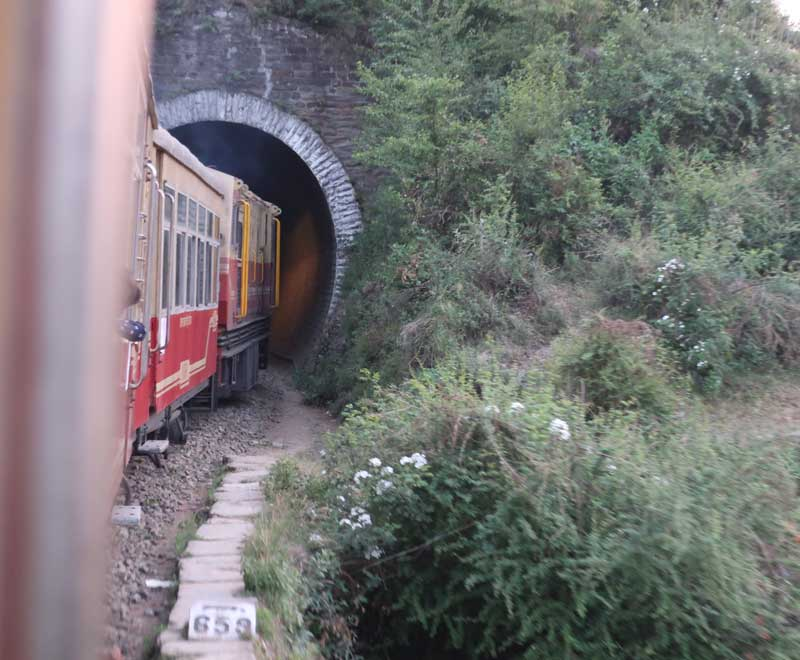
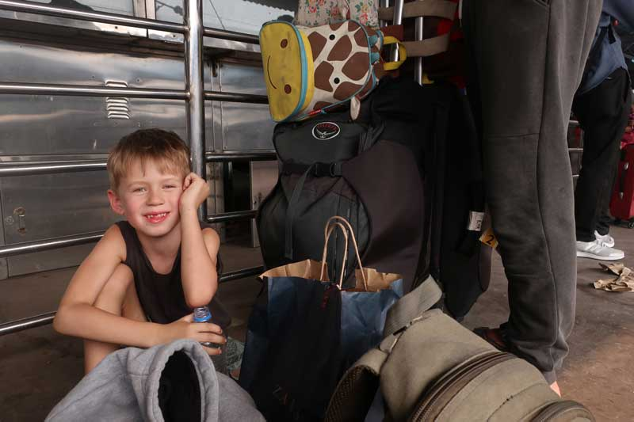
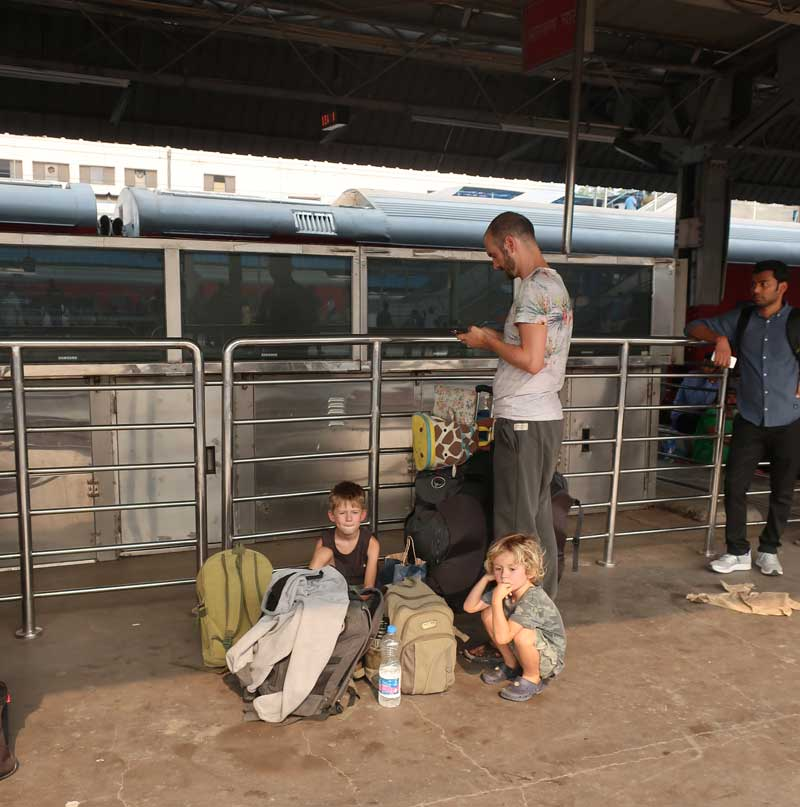
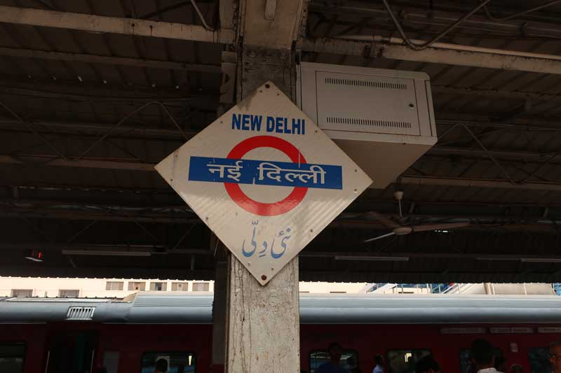
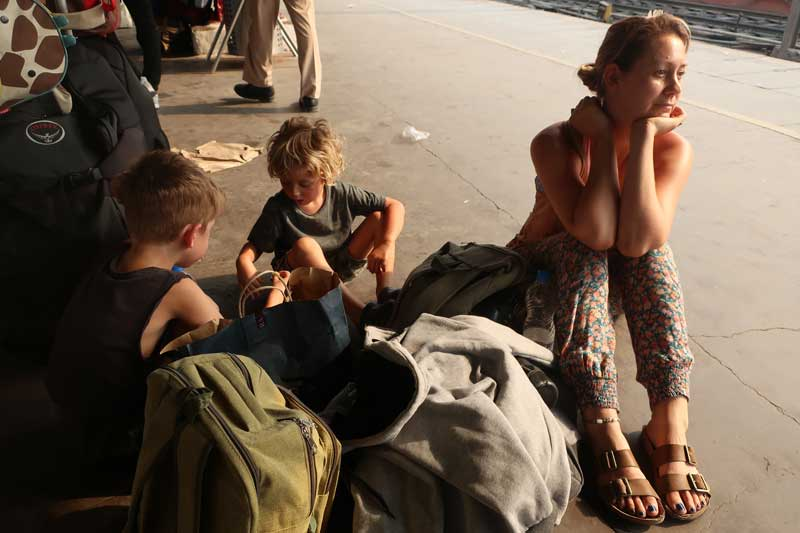
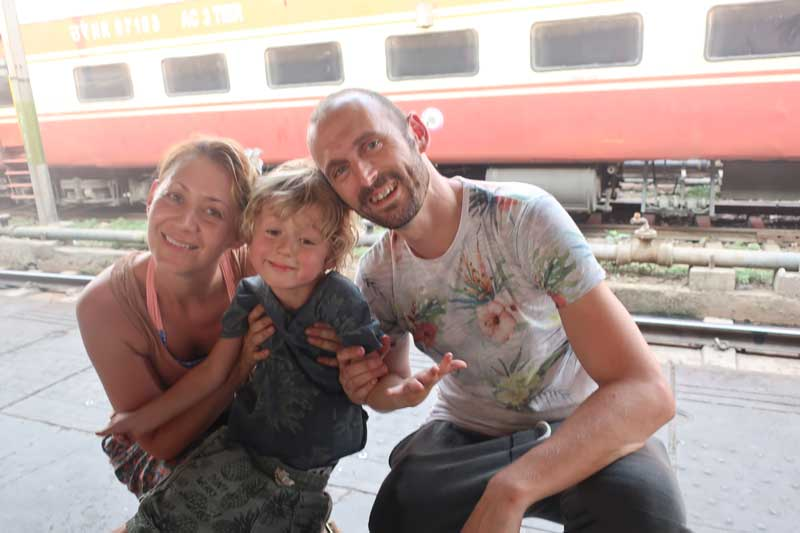
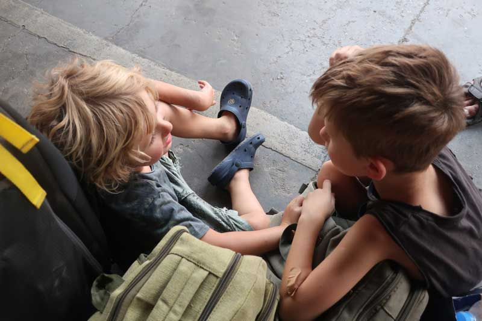
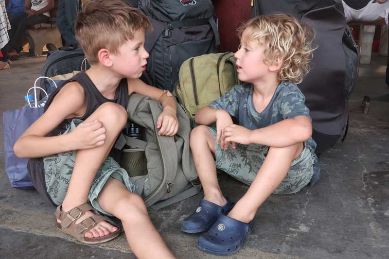
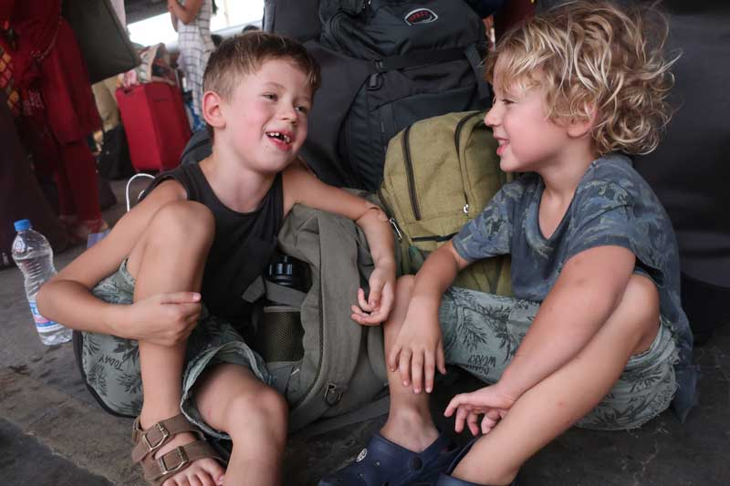

### We went to see leopards

They were growling at Daddy.

=YOUTUBESTART=bvqNTW5y8Jk=YOUTUBEEND=

=YOUTUBESTART=j279y7AQ10M=YOUTUBEEND=
