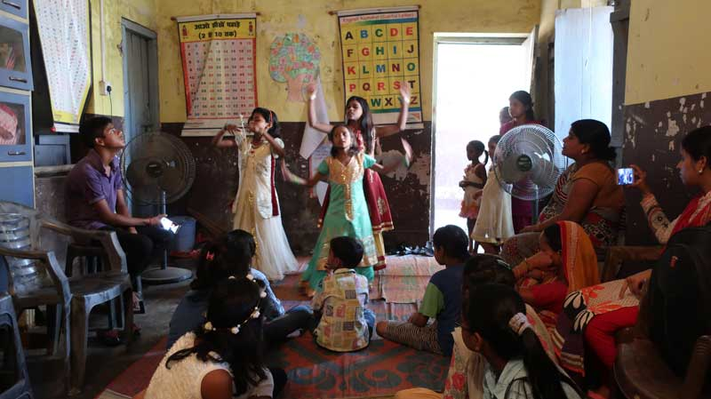

The heat of Patna got to us and Elliot was developing a cold, so I went with World Vision alone today and left Will behind to have boy fun in the air-conditioned room.

I was taken to a different slum and introduced to the staff and children of their children's club. The club is there to provide extra curricular activities, drama, dance, arts and vital life skills.

The children were beautiful inside and out. They performed many songs and dances for me and I was so touched, I was almost in tears.

_Posted by Vicky (Mummy)_

=YOUTUBESTART=kr7zWdN_ocE=YOUTUBEEND=

