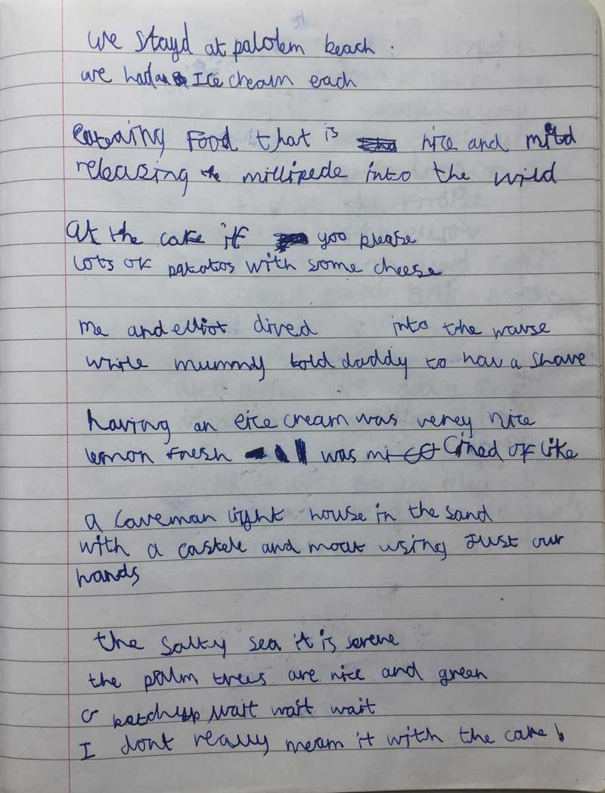

We stayed at Palolem beach  
We had an ice cream each

Eating food that is nice and mild  
Releasing the millipede into the wild

At the cafe, if you please  
Lots of potatoes with some cheese

Me and Elliot dived into the waves  
While Mummy told Daddy to have a shave

Having an ice cream was very nice  
Lemon fresh was my kind of like

A caveman lighthouse in the sand  
With a castle and moat using just our hands

The salty sea, it is serene  
The palm trees are nice and green

Ketchup wait wait wait  
I don't really mean it with the cake

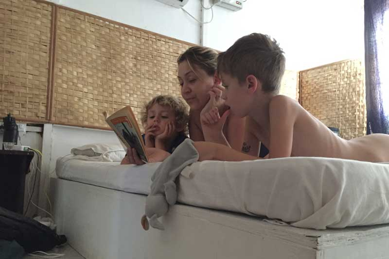
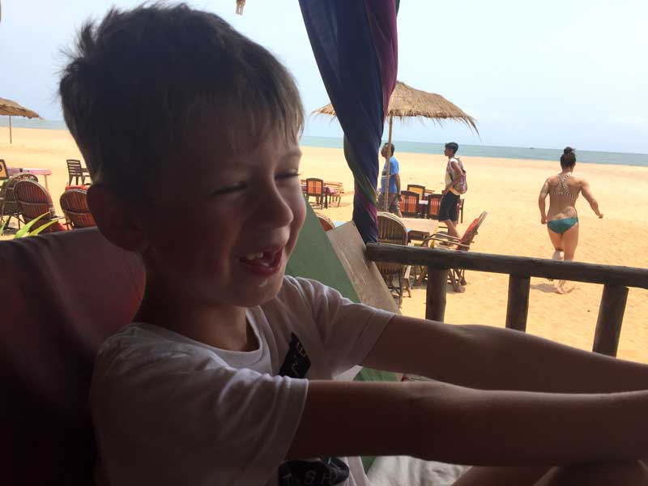
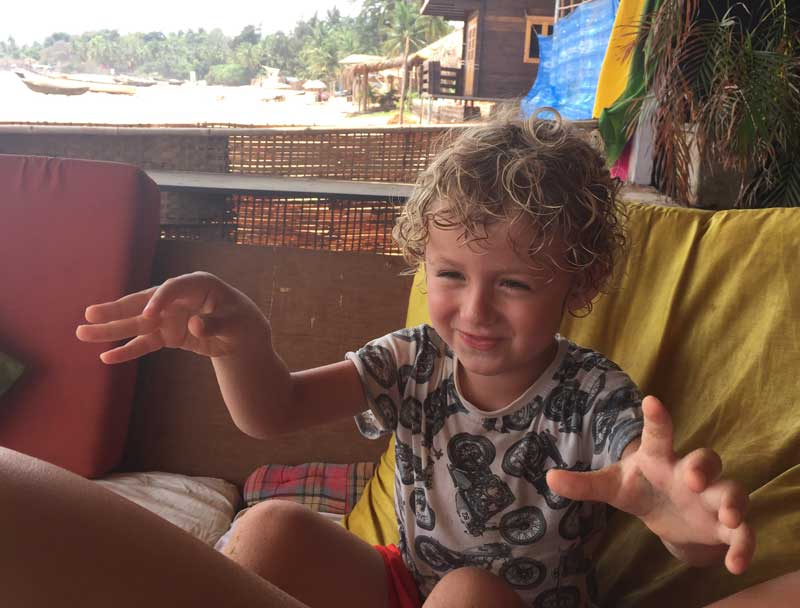
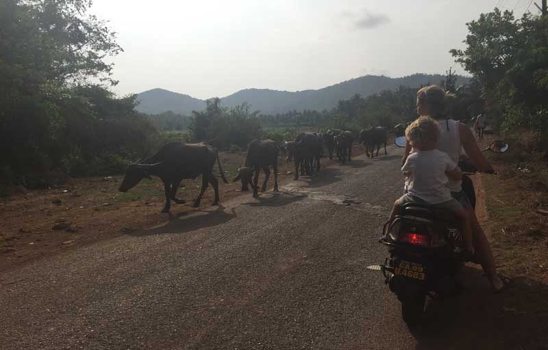
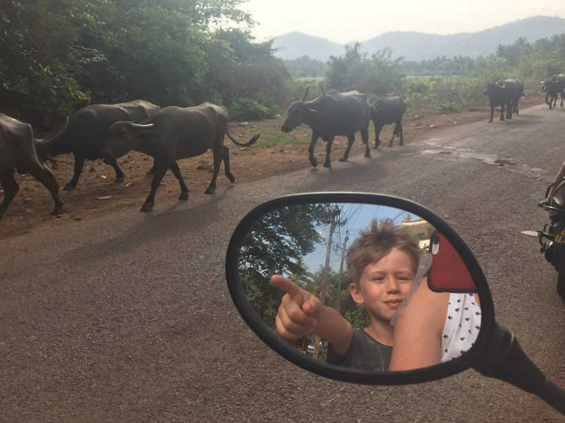
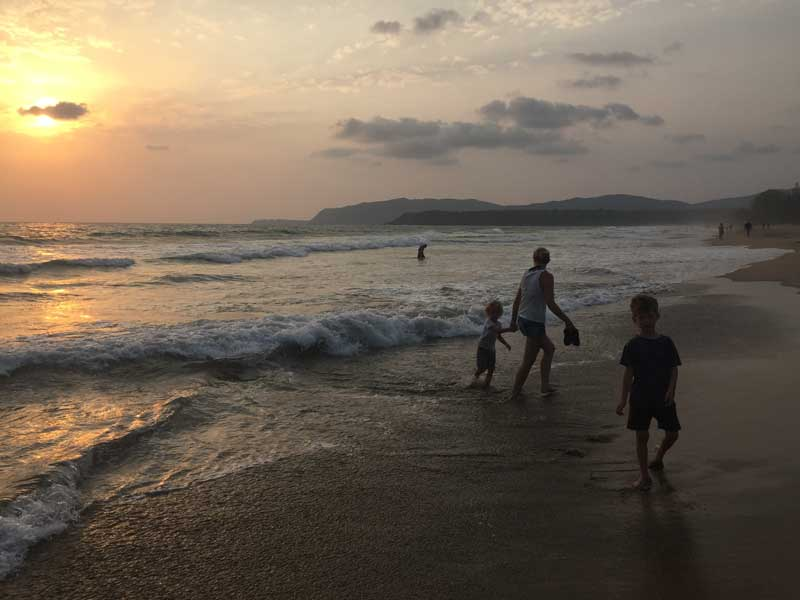
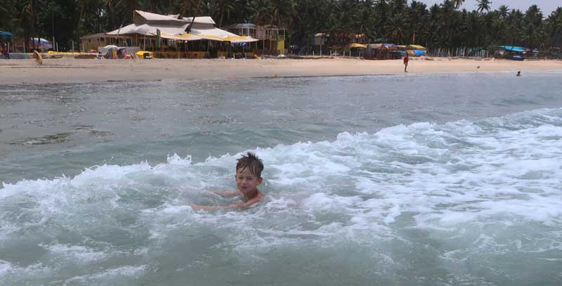
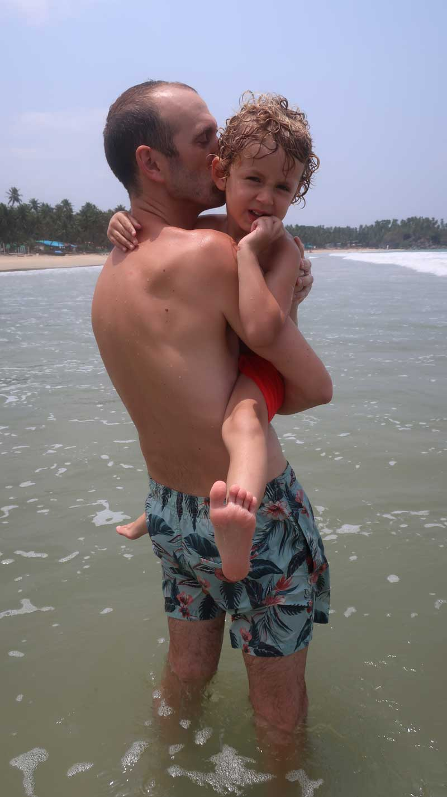
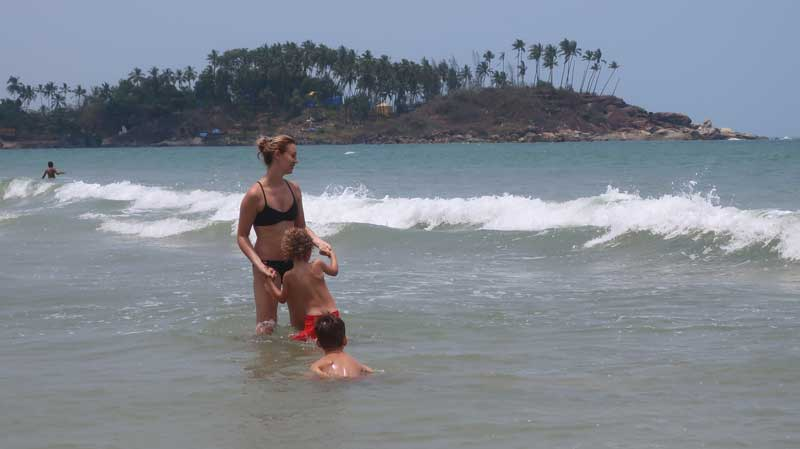
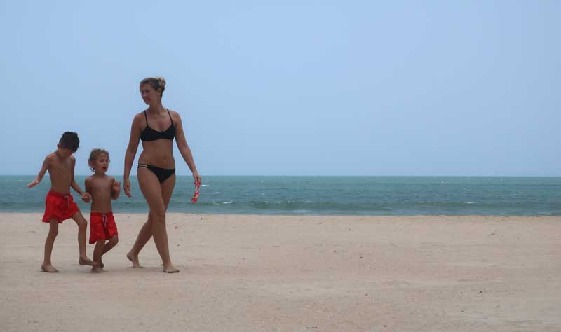
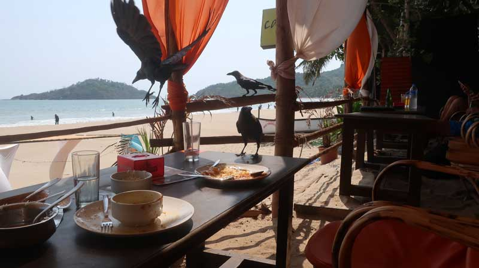
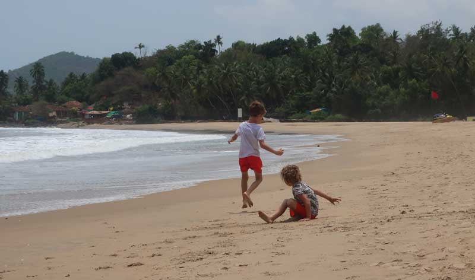
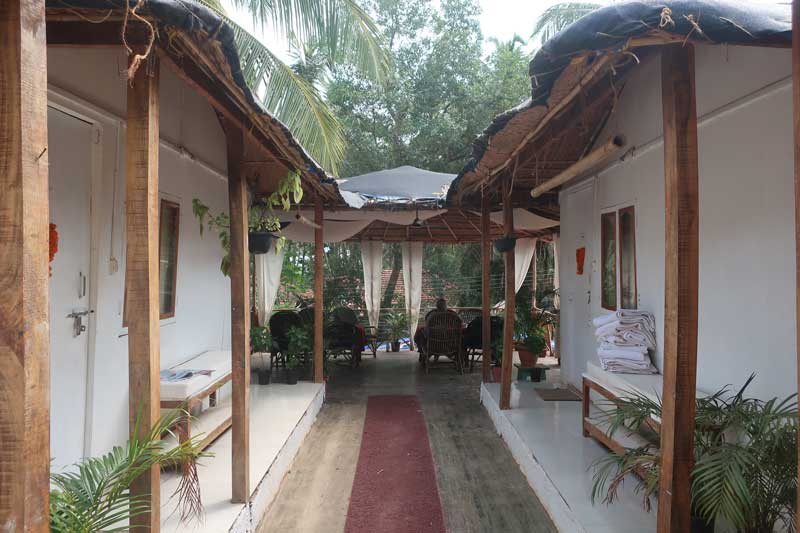
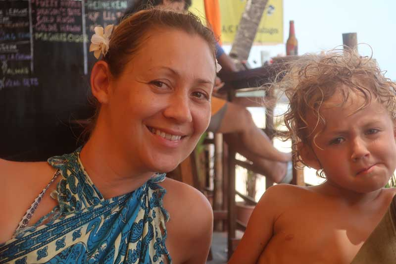
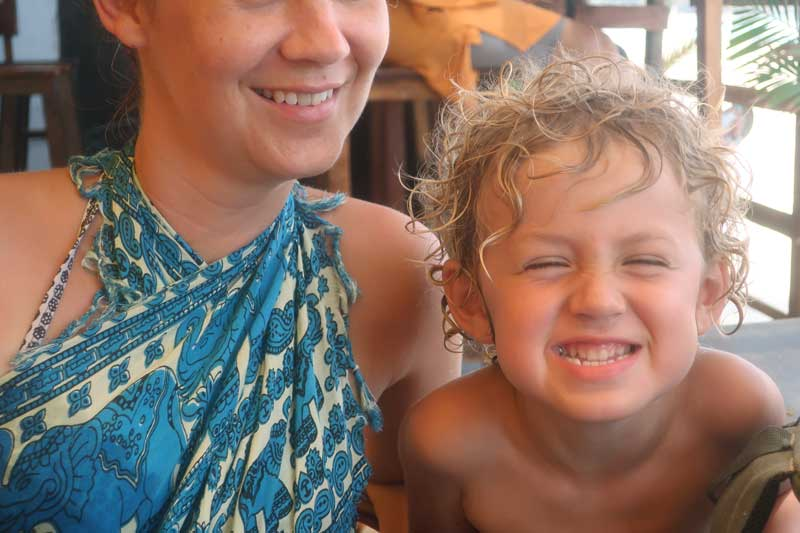
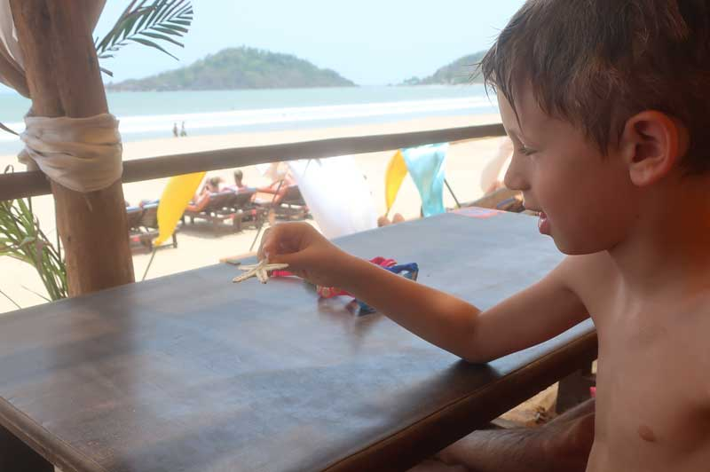
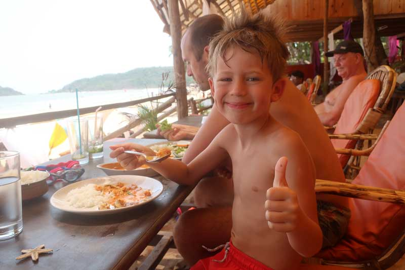
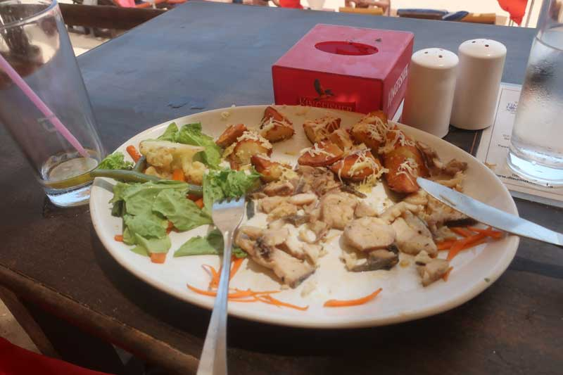

=YOUTUBESTART=IClSqX7eOaU=YOUTUBEEND=

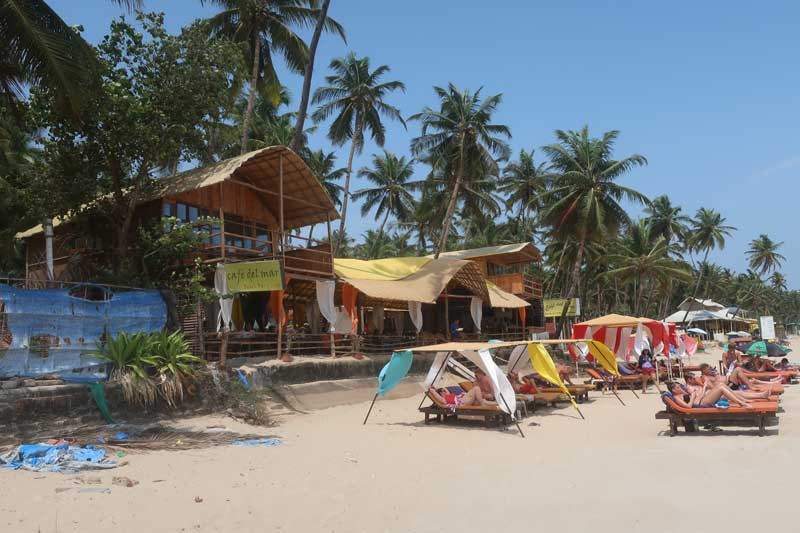
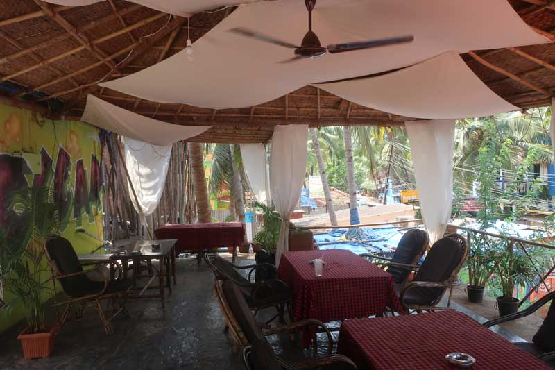
